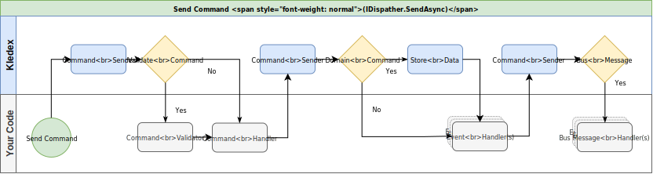

# OpenCQRS

OpenCQRS is a .NET 6 framework that can be used to create a simple and clean design by enforcing single responsibility and separation of concerns.

Its advanced features are ideal for Domain Driven Design (DDD), Command Query Responsibilty Segragation (CQRS) and Event Sourcing.

With OpenCQRS you can automatically dispatch events to a message bus (Service Bus or RabbitMQ), validate your commands before they are sent to the command handler (FluentValidation) and automatically cache the result of your queries (Memory or Redis).

**Full Documentation**: [OpenCQRS Wiki](https://lucabriguglia.github.io/OpenCQRS).

## Main Flow

## Packages

### Main

| Package | Latest Stable |
| --- | --- |
| [OpenCqrs](https://www.nuget.org/packages/OpenCqrs) |  |

### Store Providers

| Package | Latest Stable |
| --- | --- |
| [OpenCqrs.Store.Cosmos.Mongo](https://www.nuget.org/packages/OpenCqrs.Store.Cosmos.Mongo) |  |
| [OpenCqrs.Store.Cosmos.Sql](https://www.nuget.org/packages/OpenCqrs.Store.Cosmos.Sql) |  |
| [OpenCqrs.Store.EF.MySql](https://www.nuget.org/packages/OpenCqrs.Store.EF.MySql) |  |
| [OpenCqrs.Store.EF.PostgreSql](https://www.nuget.org/packages/OpenCqrs.Store.EF.PostgreSql) |  |
| [OpenCqrs.Store.EF.Sqlite](https://www.nuget.org/packages/OpenCqrs.Store.EF.Sqlite) |  |
| [OpenCqrs.Store.EF.SqlServer](https://www.nuget.org/packages/OpenCqrs.Store.EF.SqlServer) |  |
| [OpenCqrs.Store.EF.InMemory](https://www.nuget.org/packages/OpenCqrs.Store.EF.InMemory) |  |
| [OpenCqrs.Store.EF.Cosmos](https://www.nuget.org/packages/OpenCqrs.Store.EF.Cosmos) |  |

### Bus Providers

| Package | Latest Stable |
| --- | --- |
| [OpenCqrs.Bus.ServiceBus](https://www.nuget.org/packages/OpenCqrs.Bus.ServiceBus) |  |
| [OpenCqrs.Bus.RabbitMQ](https://www.nuget.org/packages/OpenCqrs.Bus.RabbitMQ) |  |

### Validation Providers

| Package | Latest Stable |
| --- | --- |
| [OpenCqrs.Validation.FluentValidation](https://www.nuget.org/packages/OpenCqrs.Validation.FluentValidation) |  |

### Caching Providers

| Package | Latest Stable |
| --- | --- |
| [OpenCqrs.Caching.Memory](https://www.nuget.org/packages/OpenCqrs.Caching.Memory) |  |
| [OpenCqrs.Caching.Redis](https://www.nuget.org/packages/OpenCqrs.Caching.Redis) |  |

### Misc

| Package | Latest Stable |
| --- | --- |
| [OpenCqrs.UI](https://www.nuget.org/packages/OpenCqrs.UI) |  |
