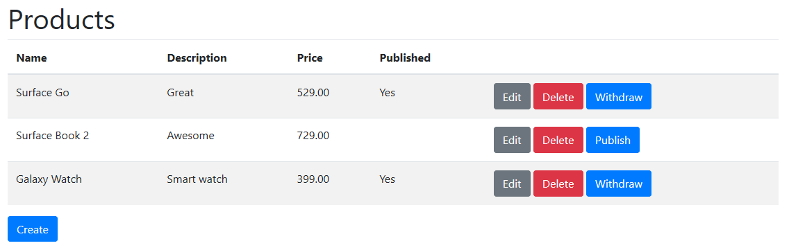

# Samples

Run the sample web projects to view how Kledex works and how it produces the same results with or without using event sourcing. The sample web applications use an experimental Kledex.UI package that returns a DTO containing the aggregate model with all events.

The following is a list of products created using the sample web application:

And this is a detailed view of a product with all associated events:

